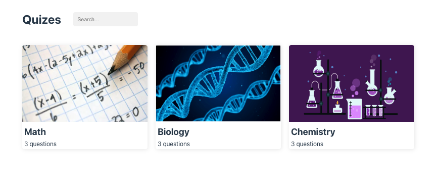

# vue3-quiz

Practice vue 3 by building a Quiz App.

Course is from Udemy by instructor: Laith Harb

## Project Overview

Overview of the Quiz Game

**Quiz game**
* View different quizzes - Display Cards 
* Search for a particular quiz - Search Bar / Filter results
* Quiz Cards - Navigate to that Quiz Type (Routes) 
* Display Quiz - Display questions and able to select Answer 
* Display animated results


## Project Setup

```sh
npm install
```

### Compile and Hot-Reload for Development

```sh
npm run dev
```

### Type-Check, Compile and Minify for Production

```sh
npm run build
```

## Screenshots

Rendering the cards



Search Functionality


